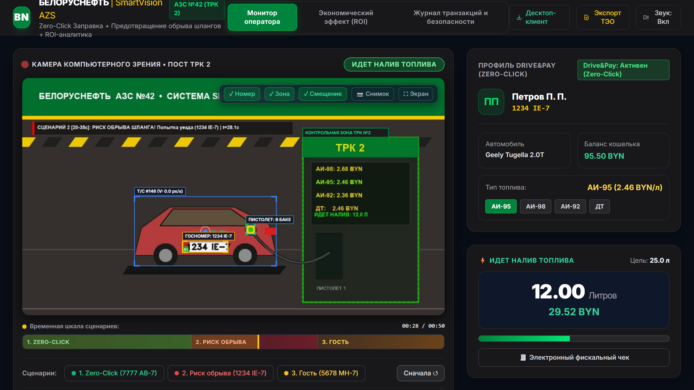
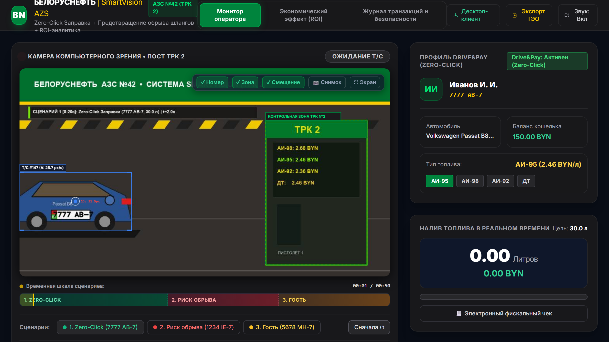
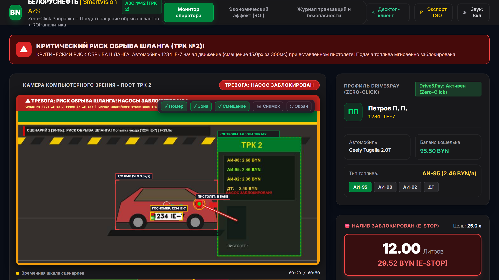
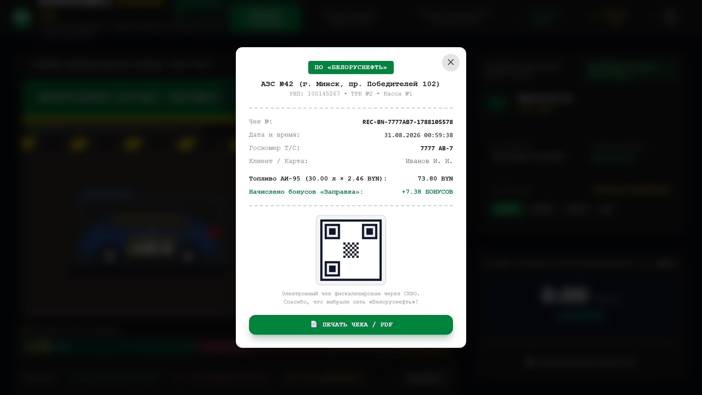
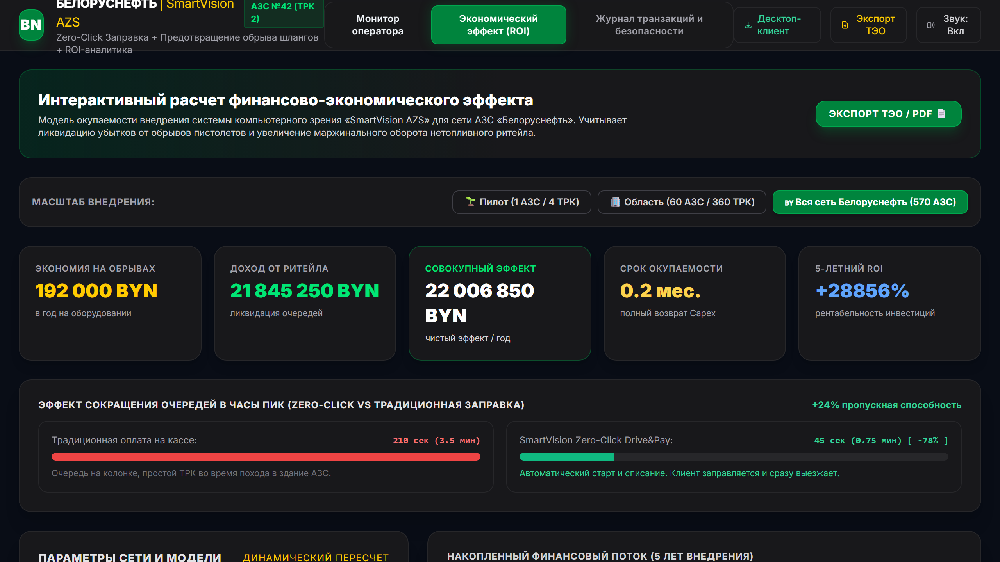

<!-- _class: lead -->
<!-- _paginate: false -->

Марафон ИТ-стартапов 2026 · Номинация: Цифровая АЗС

# SmartVision AZS
## Автоматизация ТРК, компьютерное зрение и предиктивная безопасность

  

    
45 сек

    
Полный цикл заправки вместо 210с (-78%)

  

  

    
300 мс

    
Аппаратный E-STOP отсечки при риске обрыва

  

  

    
22.0 млн

    
BYN чистого годового эффекта на сеть

  

 

Разработчик проекта · ПО «Белоруснефть» · 2026 год

---

Проблематика

# Потери и риски сети АЗС
## Анализ ключевых факторов простоя колонок и внеплановых расходов

  

    

      <strong>Очереди на кассах (210с / авто)</strong>
      
75% времени колонка заблокирована в ожидании оплаты водителем в торговом зале.

    

    

      <strong>Обрывы шлангов (до 160 инцидентов/год)</strong>
      
Прямой ущерб свыше 192 000 BYN (разрывные муфты, ремонт, простой колонок).

    

    

      <strong>Кассовые разрывы в кафе</strong>
      
Очереди за топливом отпугивают покупателей сопутствующих товаров и кофе (-12% выручки).

    

  

  

    
-75%

    
Потери пропускной способности ТРК из-за походов на кассу

    

    
<strong>Задача:</strong> Автоматизировать идентификацию, налив и безопасность ТРК без установки дорогостоящих уличных терминалов на каждой колонке.

  

---

Концепция

# Архитектура комплекса SmartVision AZS
## Превращение стандартной ТРК в автономный пост по существующим камерам

  

    

      <strong>1. Edge AI Компьютерное зрение</strong>
      
YOLOv8 Nano (30 FPS) распознает номера авто (OCR > 98%), кузов и положение пистолета.

    

    

      <strong>2. Предиктивный E-STOP (300 мс)</strong>
      
Мгновенная отсечка насоса при смещении авто > 15px до натяжения рукава.

    

    

      <strong>3. Бесшовный налив Zero-Click</strong>
      
Интеграция с Drive&Pay: автоматический пуск и безакцептное списание.

    

    

      <strong>4. Фискализация и СКНО</strong>
      
Генерация электронных чеков с QR-кодом и передача в налоговые органы.

    

  

  

    
  

---

Сценарий 1

# Сквозной налив Zero-Click (Drive&Pay)
## Полный цикл обслуживания без посещения кассы за 45 секунд

  

    

      <strong>1. Подъезд и детекция (t=0..3c)</strong>
      
Автоматическое распознавание номера (7777 AB-7) и профиля водителя.

    

    

      <strong>2. Вставка пистолета (t=4..8c)</strong>
      
Фиксация сопла в горловине бака. Автоматический пуск насоса АИ-95.

    

    

      <strong>3. Автоматический налив (t=9..35c)</strong>
      
Отпуск 30.0 л с передачей телеметрии на монитор оператора.

    

    

      <strong>4. Списание и чек (t=36..45c)</strong>
      
Безакцептное списание 73.80 BYN и начисление бонусов.

    

  

  

    
  

---

Сценарий 2 · Безопасность

# Предотвращение обрыва шлангов (E-STOP)
## Аппаратная отсечка насоса за 300 мс при начале движения авто

  

    

      <strong>Оптический трекинг смещения (ΔD > 15px)</strong>
      
Пока пистолет в баке, система контролирует координаты кузова 30 раз в секунду.

    

    

      <strong>Мгновенное реле E-STOP (< 300 мс)</strong>
      
Снятие питания с электромагнитного клапана ТРК до натяжения разрывной муфты.

    

    

      <strong>Тревога и фотофиксация</strong>
      
Включение светозвуковой сирены и запись HD стоп-кадра инцидента в журнал.

    

    

      
Экономия 192 000 BYN/год на сохранности колонок

    

  

  

    
  

---

Сценарий 3 · Фискализация

# Гостевой режим и электронные чеки
## Универсальная поддержка клиентов без приложения и наличных расчетов

  

    

      <strong>Гостевой режим (5678 MH-7)</strong>
      
Обслуживание незарегистрированных клиентов через кассу / терминал.

    

    

      <strong>Электронный чек с QR-кодом</strong>
      
Фискализация стандартов МНС РБ (наименование, литры, сумма, бонусы).

    

    

      <strong>Совместимость с СКНО</strong>
      
Бесшовная передача данных в учетные и налоговые системы «Белоруснефть».

    

  

  

    
  

---

Архитектура

# Технологический стек и надежность
## Модульный Edge AI контур для работы на типовых ПК заправочных станций

  

    <h3>Edge AI Vision</h3>
    
<strong>YOLOv8 Nano + OpenCV</strong>

    
30 FPS на процессорах Intel Core i3/i5 без дорогостоящих дискретных GPU.

  

  

    <h3>Backend & Events</h3>
    
<strong>FastAPI + SQLite WAL</strong>

    
Асинхронная телеметрия по WebSockets (12.5 Гц), устойчивость к сбоям питания.

  

  

    <h3>Клиент оператора</h3>
    
<strong>Edge WebView2 (.EXE)</strong>

    
Автономный десктоп-клиент в 1 клик, инсталлятор с системными ярлыками.

  

 

  

    <h3>Локальная автономность (Offline Resilience)</h3>
    
При потере связи с облаком станция продолжает налив и защиту от обрыва автономно.

  

  

    <h3>Экономия сетевого трафика (< 50 КБ/мин)</h3>
    
Видео обрабатывается локально; в центр передаются только телеметрия и стоп-кадры.

  

---

ТЭО и Финансы

# Экономическая эффективность и окупаемость
## Расчет финансовой модели на масштабе сети «Белоруснефть» (570 АЗС)

  

    <table class="table-custom">
      <thead>
        <tr>
          <th>Статья эффекта</th>
          <th>Эффект (BYN/год)</th>
        </tr>
      </thead>
      <tbody>
        <tr>
          <td>Предотвращение обрывов шлангов (160 инцидентов)</td>
          <td style="color: #00A84D; font-weight: 700;">+192 000</td>
        </tr>
        <tr>
          <td>Рост продаж топлива (+4% трафика)</td>
          <td style="color: #00A84D; font-weight: 700;">+12 450 000</td>
        </tr>
        <tr>
          <td>Маржа кафе и сопутствующих товаров</td>
          <td style="color: #00A84D; font-weight: 700;">+9 364 850</td>
        </tr>
        <tr style="background: #1E293B;">
          <td><strong>ЧИСТЫЙ ГОДОВОЙ ЭФФЕКТ</strong></td>
          <td style="color: #FFCC00; font-weight: 900;">22 006 850 BYN</td>
        </tr>
      </tbody>
    </table>
    

      
<strong>CAPEX на всю сеть:</strong> 380 000 BYN · <strong>Окупаемость:</strong> &lt; 1 мес.

    

  

  

    
  

---

Масштабирование

# Пресеты поэтапного внедрения
## Сценарии развертывания от пилотной станции до масштаба всей сети

  

    
Этап 1 · Пилот

    <h3>1 АЗС / 4 ТРК</h3>
    
<strong>CAPEX:</strong> 6 500 BYN

    
<strong>Эффект:</strong> 38 600 BYN/год

    
<strong>Окупаемость:</strong> 2 месяца

    
Тестирование на АЗС №1 г. Минск, калибровка камер.

  

  

    
Этап 2 · Область

    <h3>60 АЗС / 360 ТРК</h3>
    
<strong>CAPEX:</strong> 85 000 BYN

    
<strong>Эффект:</strong> 2.31 млн BYN/год

    
<strong>Окупаемость:</strong> 1 месяц

    
Оснащение магистралей М1, М3, М5 и областных центров.

  

  

    
Этап 3 · Вся сеть

    <h3>570 АЗС / 3 420 ТРК</h3>
    
<strong>CAPEX:</strong> 380 000 BYN

    
<strong>Эффект:</strong> 22.0 млн BYN/год

    
<strong>Окупаемость:</strong> 20 дней

    
Полная раскатка на все заправочные станции сети.

  

 

  
Комплекс окупается уже на стадии пилота за счет предотвращения даже 1–2 инцидентов обрыва гидравлики.

---

Сравнение

# Преимущества перед терминалами самообслуживания (OPT)
## Почему SmartVision AZS эффективнее и экономичнее классических терминалов

  

    <h3 style="color: #F87171;">Стационарные терминалы (OPT)</h3>
    
• Стоимость от 15 000 BYN на каждую колонку.

    
• Земляные работы, кабельные трассы, сертификация.

    
• Не защищают от обрыва раздаточного рукава.

    
• Клиент мерзнет на улице, набирая данные на клавиатуре.

  

  

    <h3 style="color: #00A84D;">Комплекс SmartVision AZS</h3>
    
• В <strong>10 раз дешевле</strong> (использует штатные камеры).

    
• Развертывание за <strong>1 рабочий день</strong> без простоя АЗС.

    
• Встроенная защита <strong>E-STOP (&lt; 300 мс)</strong> от обрыва шланга.

    
• Сценарий <strong>Zero-Click</strong> — водитель вообще не касается экрана.

  

 

  

    
1 день

    
Монтаж и запуск на станции

  

  

    
x10

    
Экономия бюджета против OPT

  

  

    
100%

    
Отечественный стек ПО

  

---

<!-- _class: lead -->
<!-- _paginate: false -->

Готовность к внедрению

# SmartVision AZS — Готов к промышленному пилоту
## Работающий прототип развернут и доступен для тестирования комиссии

  

    <h3>Инфраструктура проекта</h3>
    
• <strong>Онлайн-дашборд и симулятор ТРК:</strong> <a href="https://smartvision-azs.onrender.com" style="color: #38BDF8; text-decoration: none;">https://smartvision-azs.onrender.com</a>

    
• <strong>Десктоп-клиент для операторов (Setup .EXE / Portable):</strong> <a href="https://smartvision-azs.onrender.com/download" style="color: #38BDF8; text-decoration: none;">https://smartvision-azs.onrender.com/download</a>

    
• <strong>Открытый репозиторий и исходный код:</strong> <a href="https://github.com/ArtemChik103/smartvision-azs-belorusneft" style="color: #38BDF8; text-decoration: none;">GitHub: ArtemChik103/smartvision-azs-belorusneft</a>

  

  

    <h3>Контакты и согласование пилота</h3>
    
<strong>Номинация:</strong> Цифровая АЗС

    
<strong>Конкурс:</strong> «Марафон ИТ-стартапов» 2026

    
<strong>Заказчик:</strong> РУП «ПО «Белоруснефть»

    
Готовы к развертыванию пилотной зоны на АЗС №1 г. Минска

  

 

SmartVision AZS · Белоруснефть · 2026

